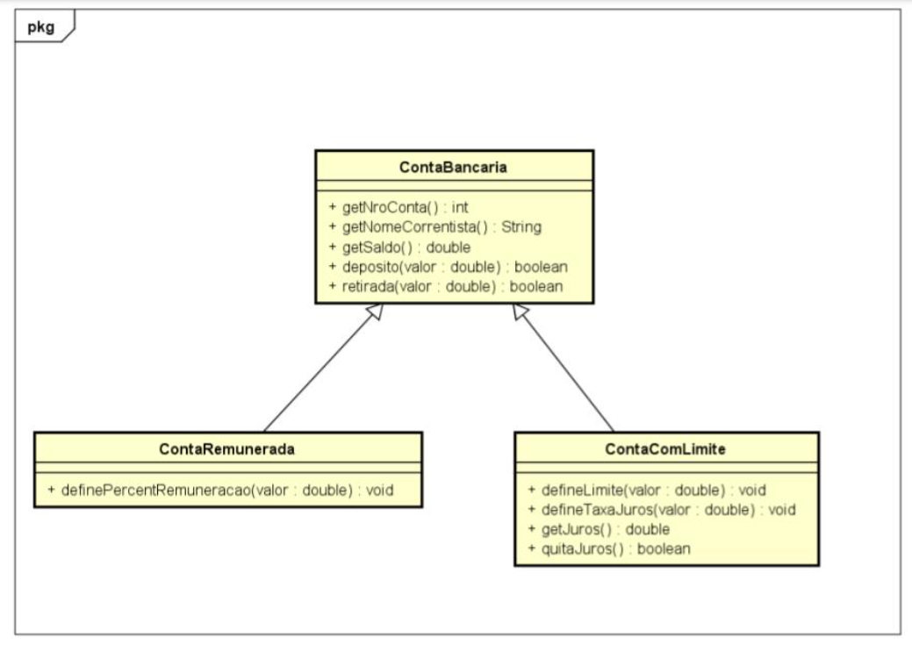

## Descrição do exercício
Analise a figura que segue e implemente a hierarquia de classes definida na mesma

- A “ContaBancaria” implementa as funcionalidades básicas de uma conta corrente.

- A “ContaRemunerada” remunera cada depósito usando o percentual definido. O crédito é feito no momento do depósito.

- A “ContaComLimite” permite que sejam feitos saques a descoberto até o limite informado. Os juros são calculados no momento da retirada que ultrapassa o saldo. O método “getJuros” informa o montante devido de juros até o momento. O método “quitaJuros” zera o valor devido em juros debitando os mesmos da conta desde que haja saldo para tanto